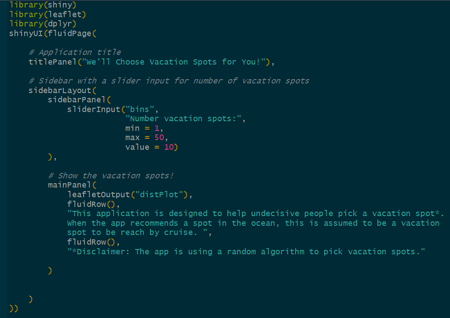
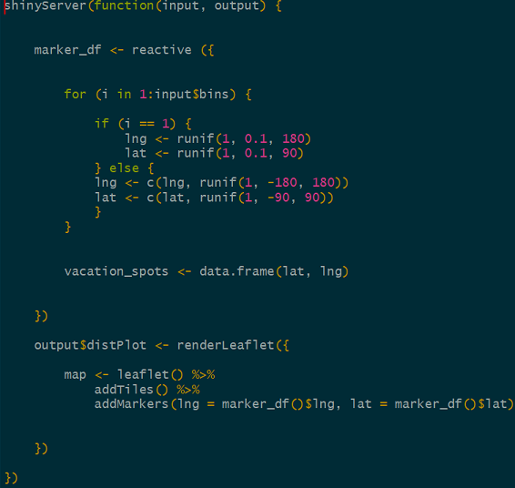

## Introduction

The Perfect Vacation Spot finder is a tool targeted at the significant subset of the population that struggles deciding where to go for their next vacation. The tool as a simple input and output.

* Input: Number of Vacation Spots desired

* Output: Leaflet map with the desired number of vacation spots (randomly generated).

The concept of this application is very simple due the very powerful Paradox of Choice.

The Paradox dictates that humans tend to be happier about their decisions when there are less options to choose from.

Event though the application generates random vacation spots, leaning on this concept, the number of possible choices is immediately reduced and thus users will tend to be happier about their selection from the options provided by the app.


--- .class #id 

## ui.R code



--- .class #id 

## server.R code



--- .class #id 

## Vacation Spot Selection
Longitude and latitude


```{r message=FALSE}
for (i in 1:2) {
            if (i == 1) {
                lng <- runif(1, 0.1, 180)
                lat <- runif(1, 0.1, 90)
            } else {
            lng <- c(lng, runif(1, -180, 180))
            lat <- c(lat, runif(1, -90, 90))
            }
        }
        vacation_spots <- data.frame(lat, lng)
        vacation_spots
```

--- .class #id 


## Web App View

Go to the app [here](https://jaimeoh123.shinyapps.io/week_4/)

--- .class #id 
